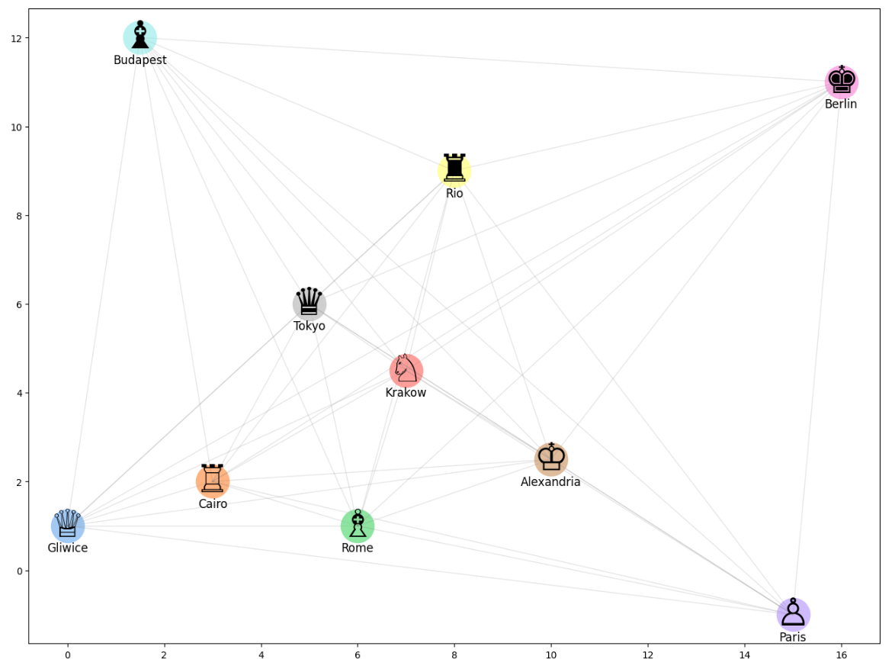
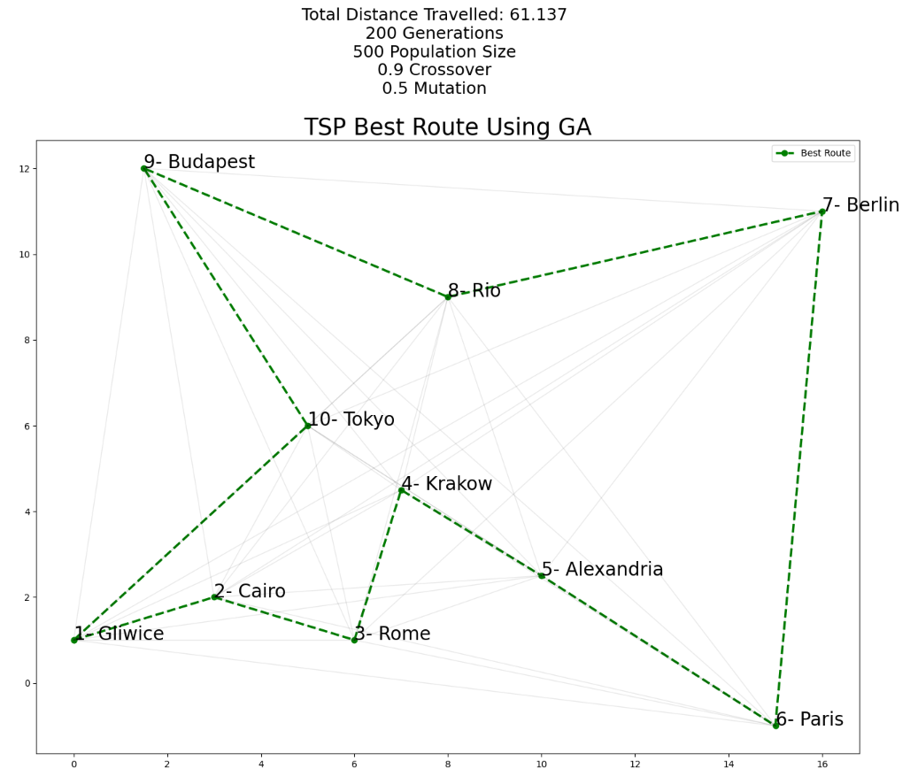

# Traveling Salesman Problem Solution using Genetic Algorithm

This repository provides a solution to the classic Traveling Salesman Problem (TSP) using a genetic algorithm. The genetic algorithm is a heuristic optimization method inspired by the process of natural selection and genetic variation.

## Problem Description

The Traveling Salesman Problem (TSP) is a well-known combinatorial optimization problem. Given a list of cities and the distances between each pair of cities, the objective is to find the shortest possible route that visits each city exactly once and returns to the starting city.

## Genetic Algorithm Approach

The genetic algorithm is a metaheuristic that mimics the process of natural selection. In the context of the TSP, the algorithm works as follows:

1. **Initialization**: Generate an initial population of candidate solutions, where each solution represents a possible ordering of cities to visit.

2. **Evaluation**: Evaluate the fitness of each candidate solution by calculating the total distance of the TSP route.

3. **Selection**: Select a set of parent solutions from the current population based on their fitness. Solutions with better fitness have a higher probability of being selected.

4. **Crossover**: Create new offspring solutions by combining the genetic material (city orderings) of the selected parents.

5. **Mutation**: Introduce random changes to the offspring solutions to maintain diversity and explore new regions of the solution space. Swap mutation and inversion mutation are commonly used mutation operators.

6. **Population Management**: Replace some solutions in the current population with the newly generated offspring solutions.

7. **Termination**: Repeat steps 2-6 for a certain number of generations or until a termination condition is met (e.g., reaching a maximum number of generations).

8. **Solution Extraction**: Once the algorithm terminates, extract the best solution found (i.e., the shortest route) from the final population.

## Usage

To use the genetic algorithm implementation in this repository, follow these steps:

1. Clone the repository: `git clone https://github.com/ShendoxParadox/TSP-Genetic-Algorithm.git`.

4. Configure the algorithm parameters, such as population size, crossover and mutation rates, and termination criteria.

5. Run the Notebook script.

6. Monitor the algorithm's progress and wait for it to terminate.

7. Retrieve the best solution.

## Contributing

Contributions to this repository are welcome. If you have any ideas, suggestions, or improvements, feel free to open an issue or submit a pull request.

## License

This project is licensed under the [The Unlicense] [LICENSE](https://github.com/ShendoxParadox/TSP-Genetic-Algorithm/blob/main/LICENSE).
This is free and unencumbered software released into the public domain.

## Solution Example

